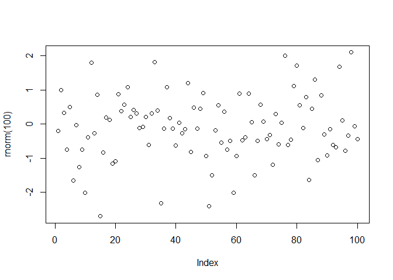

<!-- README.md is generated from README.Rmd. Please edit that file -->

# demopkg

<!-- badges: start -->

<!-- badges: end -->

The goal of `demopkg` is to provide an example on how to create a
package in R and publish it in GitHub

## Installation

You can install the development version of `demopkg` from
[GitHub](https://github.com/chiamag/demopkg) with:

``` r
devtools::install_github("https://github.com/chiamag/demopkg")
```

## Example

This is a basic example which shows you how to solve a common problem:

``` r
library(demopkg)

M<-make_data()
```

Use this code like this…

``` r
plot(rnorm(100))
```


